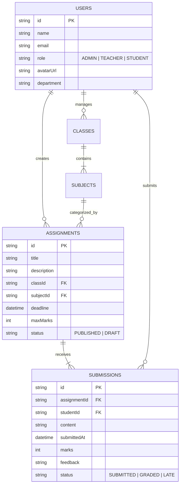

# 🎓 SCHOLLEGE — School & College Management System
### *Role-Based Assignment & Submission Management Platform*

<p align="center">
  
</p>

<p align="center">
  <a href="https://schollege-portal.vercel.app"></a>
  
  
  
  
</p>

<p align="center">
  <strong>Live Production Portal: <a href="https://schollege-portal.vercel.app">https://schollege-portal.vercel.app</a></strong>
</p>

---

## 📌 Project Overview & Brief
**Schollege** is a comprehensive, production-ready **School & College Management System** featuring a role-based **Assignment & Submission Management Platform**.

The system enables **Teachers** to publish assignments for specific classes and subjects with deadlined submission windows, **Students** to view deadlines, submit homework, and receive grades, and **Administrators** to manage user rosters, course allocations, financial analytics, and system-wide announcements.

### 🖼️ System Layouts & Interface Previews

<table>
  <tr>
    <td width="50%" align="center">
      
      <br />
      <strong>🔐 Homepage & Authentication Portal</strong>
    </td>
    <td width="50%" align="center">
      
      <br />
      <strong>🏛️ Admin Executive Dashboard</strong>
    </td>
  </tr>
  <tr>
    <td width="50%" align="center">
      
      <br />
      <strong>👩‍🏫 Teacher & Faculty Workspace</strong>
    </td>
    <td width="50%" align="center">
      
      <br />
      <strong>👨‍🎓 Student Academic Portal</strong>
    </td>
  </tr>
</table>

---

## 👑 User Roles & Responsibilities

### 🏛️ 1. Administrator Role (`/admin/dashboard`)
* **User & Personnel Management**: Create, update, and manage accounts for Students, Teachers, and Employees across departments.
* **Academic Structure**: Allocate teachers to subjects/classes, manage course offerings, and track student enrollments.
* **Global Monitoring**: Oversee all assignments, active submissions, campus calendars, and notice streams.
* **Financial Analytics**: View financial trends, revenue vs. expenditure graphs, fee collection statuses (Tuition, Lab, Transport), and messaging inbox.

### 👩‍🏫 2. Teacher / Faculty Role (`/teacher/dashboard`)
* **Assignment Management**: Create, edit, publish, draft, or delete assignments.
* **Course & Subject Scope**: Assign coursework to specific classes (e.g., *Class 12 Science*) and subjects (e.g., *Higher Mathematics*).
* **Criteria Specifications**: Define title, description, deadline, and maximum marks (e.g., *100 Marks*).
* **Submission Review & Marking**: Access student submissions, award numerical marks, set submission statuses (`SUBMITTED`, `GRADED`, `LATE`, `RETURNED`), and provide personalized feedback comments.

### 👨‍🎓 3. Student Role (`/student/dashboard`)
* **Course & Assignment Feed**: Filter assignments assigned to their enrolled class/course.
* **Assignment Details**: Inspect instructions, attached reference files, maximum marks, and countdown deadlines.
* **Online Answer Submission**: Submit text solutions and document links prior to the deadline.
* **Submission Updates**: Edit or update submitted answers before deadline expiration.
* **Grades & Feedback**: Review awarded marks, teacher remarks, CGPA transcript updates, and class routine schedules.
* **Custom Profile Avatar**: Choose from **15 custom vector avatars** or synchronize with Google OAuth Gmail avatar.

---

## 🔑 Demo Credentials (1-Click Auto-Login Supported)

The live production application supports 1-Click Quick Demo Sign-In buttons on the login screen:

| Role | Email Address | Password | Primary Route |
| :--- | :--- | :--- | :--- |
| 🛡️ **Admin** | `admin@schollege.edu.bd` | `admin123` | `/admin/dashboard` |
| 👩‍🏫 **Teacher** | `teacher@schollege.edu.bd` | `teacher123` | `/teacher/dashboard` |
| 👨‍🎓 **Student** | `student@schollege.edu.bd` | `student123` | `/student/dashboard` |

---

## 📐 Data Model & Entity Relationships



---

## 🛠️ Technology Stack & Architecture

- **Frontend Framework**: Next.js 16 (App Router, Turbopack, React 19)
- **Language**: TypeScript (Strict Type Checking)
- **Styling**: Tailwind CSS v4, Flaticon UI Icons, FontAwesome 6, Google Outfit Font
- **Data Visualization**: Recharts (Financial Curve Charts, Revenue Donut Charts, Bar Graphs)
- **Authentication**: BetterAuth SDK + Role-Based Access Control (RBAC) + Google OAuth + Session Tokens
- **Backend API**: Next.js API Routes (`/api/assignments`, `/api/submissions`, `/api/users`, `/api/classes`, `/api/messages`, `/api/notifications`)
- **Database Storage**: Supabase PostgreSQL + Primary Data Engine (`backend/Data/`)
- **Testing**: Jest / React Testing Library unit tests for business logic & authorization

---

## ⚙️ Environment Configuration (`.env.example`)

Create a `.env.local` file inside the `frontend/` directory:

```env
# Application Base URL
NEXT_PUBLIC_APP_URL=http://localhost:3000

# BetterAuth Authentication Configuration
BETTER_AUTH_SECRET=schollege_production_auth_secret_key_2026
BETTER_AUTH_URL=http://localhost:3000

# Supabase PostgreSQL Configuration
NEXT_PUBLIC_SUPABASE_URL=https://your-supabase-project.supabase.co
NEXT_PUBLIC_SUPABASE_ANON_KEY=your-supabase-anon-key
```

---

## 💻 Local Setup & Development Instructions

### 1. Clone the Repository
```bash
git clone https://github.com/CoderGUY47/Schollege-A-School-Management-System.git
cd Schollege-A-School-Management-System
```

### 2. Install Dependencies
```bash
cd frontend
npm install
```

### 3. Run Development Server
```bash
npm run dev
```
Open [http://localhost:3000](http://localhost:3000) in your browser.

### 4. Execute Unit Tests
```bash
npm test
```

---

## 📂 Project Directory Structure

```
Schollege-A-School-Management-System/
├── backend/                        # Backend Primary Data Store & Schemas
│   └── Data/                       # Admin, Teacher, Student, Assignments Data
├── frontend/                       # Next.js 16 Application Codebase
│   ├── public/                     # Static Assets, Avatars (/images/avatars/...)
│   └── src/
│       ├── app/                    # App Router Pages & API Routes (/api/...)
│       │   ├── admin/              # Executive Admin Dashboard Routes
│       │   ├── teacher/            # Teacher Faculty Dashboard Routes
│       │   ├── student/            # Student Academic Dashboard Routes
│       │   └── api/                # RESTful API Endpoints
│       ├── components/             # Role Dashboard Views & UI Components
│       └── lib/                    # Auth, Supabase Client & Utility Modules
├── README.md                       # Comprehensive Project Documentation
└── AGENTS.md                       # Architectural Guidelines
```

---

## ✅ Final Submission Checklist

- [x] **Git Repository Link**: Accessible on GitHub.
- [x] **Full Stack Codebase**: Includes frontend, backend REST API routes, data models, and tests.
- [x] **Database Files & Seed Data**: Pre-seeded dataset included in `backend/Data/` and Supabase PostgreSQL schema.
- [x] **Demo Accounts**: Admin, Teacher, and Student login credentials functional with 1-click auto-login.
- [x] **Role-Based Access Control (RBAC)**: Authorization enforced on routes and API endpoints.
- [x] **Live Production Deployment**: Fully deployed and functional on Vercel.
- [x] **Zero Secrets Committed**: All sensitive parameters safely parameterized in environment variables.

---

## 📄 License
This project is open-source and released under the **[MIT License](LICENSE)**.
