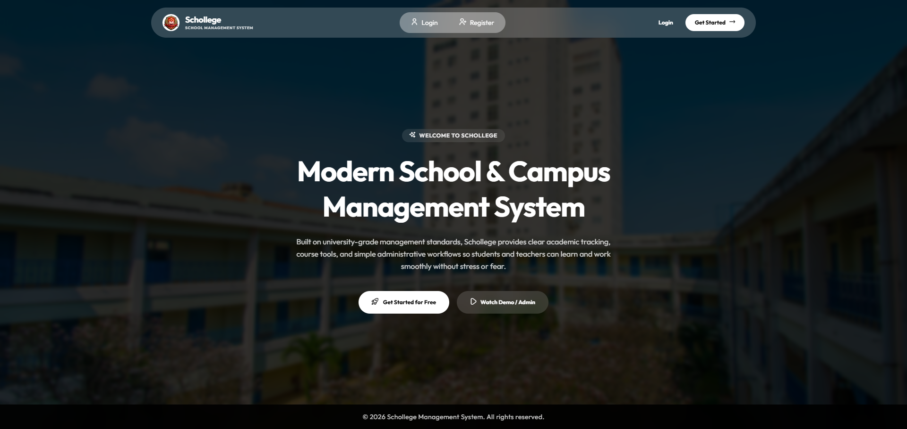
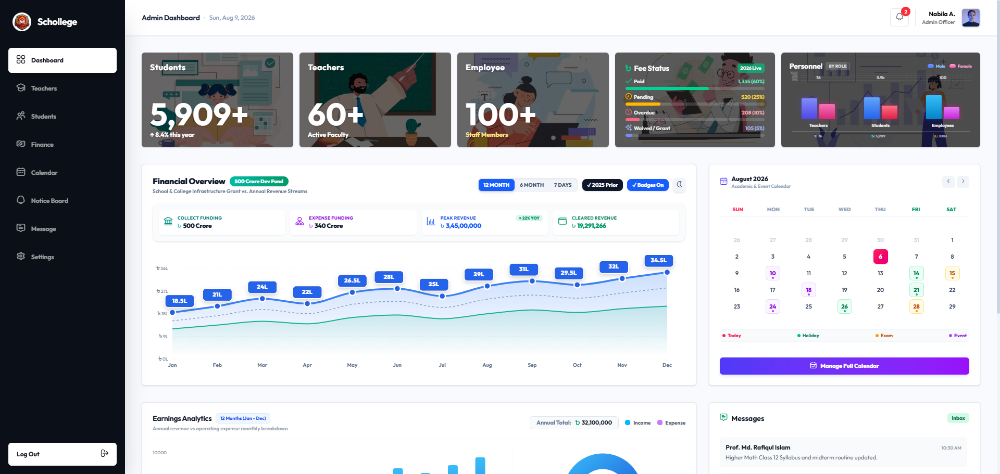
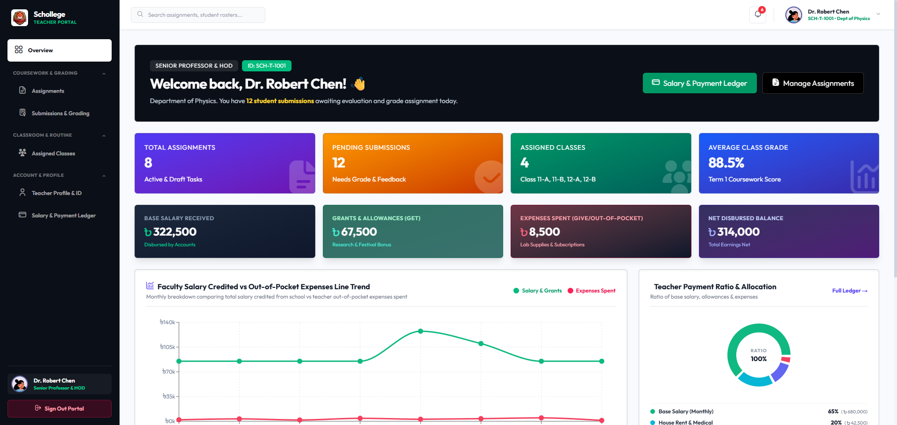
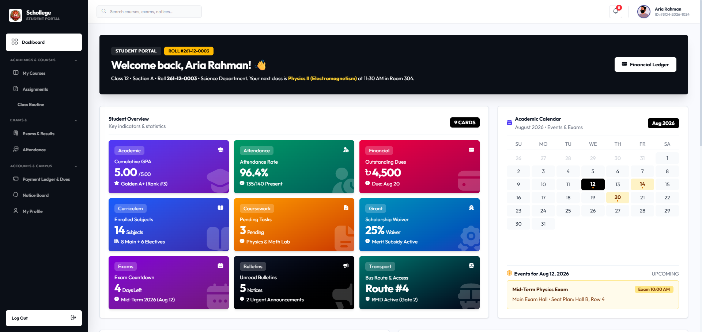

# 🎓 SCHOLLEGE - School & College Management System

## *Role-Based Assignment & Submission Management Platform*

<p align="center">
  
</p>

<p align="center">
  <a href="https://schollege-portal.vercel.app"></a>
  <a href="http://localhost:5000/swagger"></a>
  
  
  
  
</p>

<p align="center">
  <a href="https://schollege-portal.vercel.app"></a>
  &nbsp; &nbsp;
  <a href="http://localhost:5000/swagger"></a>
</p>

---

## 📌 Project Overview & Brief

**Schollege** is a comprehensive, production-ready **School & College Management System** featuring a role-based **Assignment & Submission Management Platform**.

The system enables **Teachers** to publish assignments for specific classes and subjects with deadlined submission windows, **Students** to view deadlines, submit homework, and receive grades, and **Administrators** to manage user rosters, course allocations, financial analytics, and system-wide announcements.

### 🖼️ System Layouts & Interface Previews

<table>
  <tr>
    <td width="50%" align="center">
      
      <br />
      <strong>🔐 Homepage & Authentication Portal</strong>
    </td>
    <td width="50%" align="center">
      
      <br />
      <strong>🏛️ Admin Executive Dashboard</strong>
    </td>
  </tr>
  <tr>
    <td width="50%" align="center">
      
      <br />
      <strong>👩‍🏫 Teacher & Faculty Workspace</strong>
    </td>
    <td width="50%" align="center">
      
      <br />
      <strong>👨‍🎓 Student Academic Portal</strong>
    </td>
  </tr>
</table>

---

## 👑 User Roles & Responsibilities

### 🏛️ 1. Administrator Role (`/admin/dashboard`)
* **User & Personnel Management**: Create, update, and manage accounts for Students, Teachers, and Employees across departments.
* **Academic Structure**: Allocate teachers to subjects/classes, manage course offerings, and track student enrollments.
* **Global Monitoring**: Oversee all assignments, active submissions, campus calendars, and notice streams.
* **Financial Analytics**: View financial trends, revenue vs. expenditure graphs, fee collection statuses (Tuition, Lab, Transport), and messaging inbox.

### 👩‍🏫 2. Teacher / Faculty Role (`/teacher/dashboard`)
* **Assignment Management**: Create, edit, publish, draft, or delete assignments.
* **Course & Subject Scope**: Assign coursework to specific classes (e.g., *Class 12 Science*) and subjects (e.g., *Higher Mathematics*).
* **Criteria Specifications**: Define title, description, deadline, and maximum marks (e.g., *100 Marks*).
* **Submission Review & Marking**: Access student submissions, award numerical marks, set submission statuses (`SUBMITTED`, `GRADED`, `LATE`, `RETURNED`), and provide personalized feedback comments.

### 👨‍🎓 3. Student Role (`/student/dashboard`)
* **Course & Assignment Feed**: Filter assignments assigned to their enrolled class/course.
* **Assignment Details**: Inspect instructions, attached reference files, maximum marks, and countdown deadlines.
* **Online Answer Submission**: Submit text solutions and document links prior to the deadline.
* **Submission Updates**: Edit or update submitted answers before deadline expiration.
* **Grades & Feedback**: Review awarded marks, teacher remarks, CGPA transcript updates, and class routine schedules.
* **Custom Profile Avatar**: Choose from **15 custom vector avatars** or synchronize with Google OAuth Gmail avatar.

---

## 🔑 Demo Credentials

The live production application supports 1-Click Quick Demo Sign-In buttons on the login screen:

| Role | Email Address | Password | Primary Route |
| :--- | :--- | :--- | :--- |
| 🛡️ **Admin** | `admin@demo.com` | `Schollege#Admin2026!` | `/admin/dashboard` |
| 👩‍🏫 **Teacher** | `teacher@demo.com` | `Schollege#Teacher2026!` | `/teacher/dashboard` |
| 👨‍🎓 **Student** | `student@demo.com` | `Schollege#Student2026!` | `/student/dashboard` |

> *Note: Legacy `@schollege.edu.bd` logins are also supported via auto-fill.*

---

## 🛠️ Technology Stack & Architecture

- **Frontend Framework**: Next.js 16 (App Router, Turbopack, React 19, TypeScript)
- **Styling**: Tailwind CSS v4, Flaticon UI Icons, FontAwesome 6, Google Outfit Font
- **Backend API**: ASP.NET Core 8 Web API + C#, Controller-Based REST API
- **Data Access & ORM**: Entity Framework Core 8 + Npgsql + PostgreSQL (Supabase)
- **Authentication**: JWT Bearer Tokens with Role Claims (`ADMIN`, `TEACHER`, `STUDENT`)
- **Testing**: xUnit (.NET Business Rules & Authorization Suite) + Vitest (Frontend UI Tests)
- **API Documentation**: OpenAPI / Swagger UI (`/swagger`)

---

## 📖 OpenAPI & Swagger Interactive API Server

The backend Web API provides interactive OpenAPI 3.0 documentation via Swagger UI. You can test and inspect all API endpoints directly in your browser:

* **Swagger Server UI URL**: **[http://localhost:5000/swagger](http://localhost:5000/swagger)**
* **OpenAPI Spec JSON**: **`http://localhost:5000/swagger/v1/swagger.json`**

### 📌 REST API Endpoint Reference Map

| Method | Endpoint Route | Authorization / Role | Purpose / Feature |
| :--- | :--- | :--- | :--- |
| `POST` | `/api/auth/login` | Public | Validate credentials & issue JWT token with role claim |
| `POST` | `/api/auth/register` | Public | Register new student/teacher user account |
| `GET` | `/api/assignments` | Authenticated (All) | List assignments (Student sees PUBLISHED for enrolled course; Teacher sees owned) |
| `GET` | `/api/assignments/{id}` | Authenticated (All) | Get single assignment detail with course & subject |
| `POST` | `/api/assignments` | `TEACHER`, `ADMIN` | Create new assignment (Draft or Published) |
| `PUT` | `/api/assignments/{id}` | `TEACHER`, `ADMIN` | Update assignment title, description, deadline, max marks (Teacher owner check) |
| `DELETE` | `/api/assignments/{id}` | `TEACHER`, `ADMIN` | Delete assignment (Teacher ownership check) |
| `PATCH` | `/api/assignments/{id}/status` | `TEACHER`, `ADMIN` | Update status (Draft $\rightarrow$ Published) |
| `GET` | `/api/assignments/{id}/submissions` | `TEACHER`, `ADMIN` | List all student submissions for a specific assignment |
| `GET` | `/api/submissions` | Authenticated (All) | Get submissions (Student sees owned; Teacher sees assigned) |
| `POST` | `/api/submissions` | `STUDENT` | Submit answer text + file link (Enforces class enrollment & deadline lock) |
| `PUT` | `/api/submissions/{id}` | `STUDENT` | Update submitted answer before deadline expiration |
| `POST` / `PATCH` | `/api/submissions/{id}/grade` | `TEACHER`, `ADMIN` | Assign marks & feedback (Enforces teacher ownership & `[0, MaxMarks]` cap) |
| `GET` | `/api/users` | `ADMIN` | List all system users with roles & course memberships |
| `POST` | `/api/users` | `ADMIN` | Create new user account |
| `PUT` | `/api/users/{id}` | `ADMIN` | Edit user profile & role |
| `DELETE` | `/api/users/{id}` | `ADMIN` | Delete user account |
| `GET` | `/api/classes` | Authenticated (All) | List all courses/classes with subjects and enrollments |
| `POST` | `/api/classes` | `ADMIN` | Create new class/course offering |
| `PUT` | `/api/classes/{id}` | `ADMIN` | Update class details |
| `DELETE` | `/api/classes/{id}` | `ADMIN` | Delete class offering |
| `GET` | `/api/subjects` | Authenticated (All) | List all subjects with assigned teachers |
| `POST` | `/api/subjects` | `ADMIN` | Create new subject mapped to class |
| `PUT` | `/api/subjects/{id}` | `ADMIN` | Edit subject details |
| `PATCH` | `/api/subjects/{id}/assign-teacher` | `ADMIN` | Assign or re-assign faculty teacher to subject |
| `DELETE` | `/api/subjects/{id}` | `ADMIN` | Delete subject |

---

## ⚙️ Environment Configuration

### Root / Backend Environment Variables (`.env.example`)
Create `.env` or set environment variables:
```env
# Backend Connection String (PostgreSQL / Supabase)
ConnectionStrings__DefaultConnection=Host=aws-0-ap-northeast-1.pooler.supabase.com;Port=6543;Database=postgres;Username=postgres.ceuccjbxfdyhudkigrhf;Password=YOUR_PASSWORD;SSL Mode=Require

# JWT Configuration
Jwt__Secret=SchollegeMS_Super_Secret_JWT_Signing_Key_2026_Must_Be_Long!
Jwt__Issuer=SchollegeMS.Backend
Jwt__Audience=SchollegeMS.Frontend

# CORS Allowed Origin
FrontendUrl=http://localhost:3000
```

### Frontend Configuration (`frontend/.env.local`)
```env
NEXT_PUBLIC_APP_URL=http://localhost:3000
NEXT_PUBLIC_API_URL=http://localhost:5000/api
NEXT_PUBLIC_SUPABASE_URL=https://ceuccjbxfdyhudkigrhf.supabase.co
NEXT_PUBLIC_SUPABASE_PUBLISHABLE_KEY=your_supabase_anon_key
BETTER_AUTH_SECRET=schollege_production_auth_secret_key_2026
BETTER_AUTH_URL=http://localhost:3000
```

---

## 💻 System Prerequisites & Local Setup

### Prerequisites
- **Node.js**: v20.0 or higher
- **npm**: v10.0 or higher
- **.NET SDK**: 8.0 SDK or higher
- **PostgreSQL**: 16+ (or Supabase Connection String)

### 1. Clone the Repository
```bash
git clone https://github.com/CoderGUY47/Schollege-A-School-Management-System.git
cd Schollege-A-School-Management-System
```

### 2. Backend Setup & How to Run the Backend API

Run `dotnet run` in your PowerShell terminal:
```bash
cd backend
dotnet run
```
* Swagger UI will be available at: **[http://localhost:5000/swagger](http://localhost:5000/swagger)**

### 3. Frontend Setup
```bash
cd frontend
npm install
npm run dev
```
* Frontend Application will launch at: **[http://localhost:3000](http://localhost:3000)**

### 4. Running Unit Tests
```bash
# Backend xUnit Business Rules Suite (8/8 tests)
cd backend/SchollegeMS.Tests
dotnet test

# Frontend Component & UI Validation Suite
cd frontend
npm test
```

---

## 💡 System Assumptions

1. **Class Membership**: A student belongs to one main course/class for this assessment MVP.
2. **Subject Ownership**: A subject belongs to one course/class; teachers are mapped to course-subject combinations.
3. **Text Submissions**: Students submit text solutions and optional URL attachments.
4. **Single Active Submission**: A student has one submission record per assignment, which may be updated prior to deadline expiration.
5. **Deadline Enforcement**: Submissions and updates after the deadline timestamp are automatically rejected by API business logic.
6. **Marks Boundaries**: Marks awarded by teachers must strictly be within `[0, MaxMarks]`.
7. **Draft Isolation**: Only assignments marked as `PUBLISHED` are visible to students.

---

## 🚧 Known Limitations & Future Scope

- **File Storage**: Attachments currently accept direct URLs. Direct Cloud Storage (S3/GCS/Azure Blob) can be integrated in future phases.
- **Push Notifications**: Real-time email/SMS alerts for new assignments can be added via SignalR or Webhooks.
- **Plagiarism Analysis**: Text similarity checking algorithms can be integrated post-MVP.

---

## 📂 Project Directory Structure

```
Schollege-A-School-Management-System/
├── backend/                        # ASP.NET Core 8 Web API
│   ├── Controllers/                # Auth, Assignments, Submissions, Users, Classes, Subjects
│   ├── Data/                       # AppDbContext & Seed Data
│   ├── Middleware/                 # Global Exception Middleware
│   ├── Models/                     # User, Assignment, Submission, ClassCourse, Subject
│   └── SchollegeMS.Tests/          # xUnit Business Rules Unit Tests
├── frontend/                       # Next.js 16 Application Codebase
│   ├── public/                     # Static Assets & Avatars (/images/avatars/...)
│   └── src/
│       ├── app/                    # App Router Pages & API Routes (/api/...)
│       ├── components/             # Admin, Teacher, and Student Portal Views
│       └── lib/                    # API Client, Auth Utilities & Submissions Logic
├── README.md                       # Comprehensive System Documentation
└── AGENTS.md                       # Project Architectural Guidelines
```

---

## ✅ Final Submission Checklist

- [x] **Git Repository Link**: Accessible on GitHub.
- [x] **Full Stack Codebase**: ASP.NET Core API + Next.js App Router + EF Core + xUnit.
- [x] **Database Schema & Migrations**: Reproducible PostgreSQL setup with seeded demo accounts.
- [x] **Demo Accounts**: Working credentials for Admin, Teacher, and Student with 1-click login.
- [x] **Role-Based Access Control (RBAC)**: Backend role claims enforced via `[Authorize(Roles = "...")]`.
- [x] **Business Rules Tested**: 8/8 core rule tests covering deadlines, marks, draft visibility, and ownership.
- [x] **Zero Secrets Committed**: Environment templates provided; no sensitive production secrets in source.

---

## 📄 License
This project is open-source and released under the **[MIT License](LICENSE)**.

